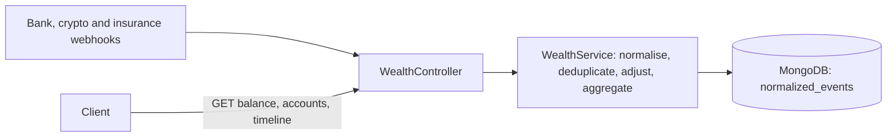

# wealth-api

A backend prototype that merges bank, crypto and insurance events into one normalised journal and computes balances per account from it.

## The problem

A person with accounts at several institutions receives events from each of them in a different shape: different field names, different ids, timestamps as ISO strings or Unix seconds or milliseconds, and different sign conventions. The same event can arrive twice, arrive late, or arrive again with a different amount. Adding up the raw payloads counts some movements twice. Overwriting the stored event to fix a contradiction destroys the history that explains the balance.

## The approach

Every webhook payload is mapped to one `NormalizedEvent`: a signed amount, the business date of the transaction, a stable id built from provider and provider-side id, and a group key. Events are only appended.

When an event arrives, the service looks for an existing one with the same `(userId, provider, transactionId)`:

- none found: the event is inserted;
- found, same amount and type: the delivery is ignored and reported as `duplicate`;
- found, different amount or type: the original is left untouched and an event of origin `adjustment` is added for the difference between the amount received and what is already recorded (the original plus its earlier adjustments). The response is `adjusted`. A redelivery of the same correction finds nothing left to adjust and is a `duplicate`. When corrections contradict each other, the last delivery wins.

Balances and the timeline are computed at read time from the journal. The timeline is ordered by business date, so late events land where they belong.

A unique index on `(userId, provider, transactionId)`, created at startup, makes the duplicate check hold when two deliveries arrive at the same time. Trade-offs accepted for a prototype: every read loads all the events of a user (no snapshot collection), there is no currency conversion, and there is no authentication.

## Engineering highlights

- **One model for three formats.** Bank, crypto and insurance payloads each have a DTO and a normaliser that outputs the same `NormalizedEvent`. See [`wealth.service.ts`](src/wealth/wealth.service.ts) (`normalizeBankEvent`, `normalizeCryptoEvent`, `normalizeInsuranceEvent`) and [`normalized-event.dto.ts`](src/wealth/dto/normalized-event.dto.ts).
- **Duplicate detection.** A replayed event with the same effect is recognised and answered with `duplicate`, and the unique index settles simultaneous deliveries (MongoDB error 11000 is read as a duplicate). See `findExistingEvent` and `storeNormalizedEvent` in [`wealth.service.ts`](src/wealth/wealth.service.ts) and `ensureIndexes` in [`mongo.provider.ts`](src/common/mongo.provider.ts).
- **Append-only corrections.** A contradictory event produces an `adjustment` event instead of an update, and keeps the previous and new payloads in `rawData`. Adjustment ids are numbered per event (`BANK-T1-adjustment-1`, `-2`, ...), so a redelivery cannot add another one. See `createAdjustmentEvent` and `findAdjustments` in [`wealth.service.ts`](src/wealth/wealth.service.ts).
- **Business date, not ingestion date.** `timestamp` holds the transaction date and the timeline sorts on it. [`date.helper.ts`](src/wealth/helpers/date.helper.ts) parses ISO strings, several day-first and month-first formats, and Unix timestamps in seconds or milliseconds. A date it cannot read falls back to the current time, with a warning in the log.
- **Validated input.** DTOs use `class-validator` and a global `ValidationPipe` strips unknown fields. See [`main.ts`](src/main.ts) and [`src/wealth/dto`](src/wealth/dto).
- **Tests without a database.** The service and the HTTP layer are tested against an in-memory stand-in for the collection that also enforces the unique index. See [`fake-collection.ts`](test/support/fake-collection.ts), [`wealth.service.spec.ts`](src/wealth/wealth.service.spec.ts) and [`app.e2e-spec.ts`](test/app.e2e-spec.ts).
- **Bounded reads.** The timeline accepts a `limit` between 1 and 1000. See `getTimeline` in [`wealth.service.ts`](src/wealth/wealth.service.ts).

## Architecture



All events, external and adjustments, live in one collection, `normalized_events`.

## API

| Method | Path | Purpose |
| --- | --- | --- |
| POST | `/api/webhooks/bank` | Bank transaction (`credit` or `debit`) |
| POST | `/api/webhooks/crypto` | Crypto transaction (`deposit` or `withdrawal`), valued at the `fiatValue` sent |
| POST | `/api/webhooks/insurance` | Insurance movement: `payout` is an inflow, any other `movementType` (premium, fee) an outflow |
| GET | `/api/wealth/balance?userId=` | Total and per-account balances |
| GET | `/api/wealth/accounts?userId=` | Per-account balances |
| GET | `/api/wealth/timeline?userId=&limit=` | Events by business date, newest first. `limit` defaults to 100, maximum 1000 |

`userId` defaults to `user-001`. A webhook answers with `status` set to `success`, `duplicate` or `adjusted`, plus the `transactionId`.

Payload fields are defined by the DTO classes under [`src/wealth/dto`](src/wealth/dto). For instance:

```bash
curl -X POST http://localhost:3000/api/webhooks/bank \
  -H "Content-Type: application/json" \
  -d '{"userId":"user-001","bankId":"BANK-A","txnId":"TXN-1","date":"2025-01-01T10:00:00Z","type":"credit","amount":1000,"currency":"EUR","account":"ACC-1","description":"Initial deposit"}'
```

## Tech stack

From [`package.json`](package.json) and [`docker-compose.yml`](docker-compose.yml):

- NestJS 10 on Express, TypeScript
- MongoDB (official Node.js driver 7, image `mongo:7.0` in Compose)
- `class-validator`, `class-transformer`, `date-fns`
- Jest 29 and supertest, ESLint 8, Prettier 3

## Getting started

```bash
git clone https://github.com/guillaume-lecomte/wealth-api
cd wealth-api
npm ci
npm run build
npm test
npm run test:e2e
cp .env.example .env
docker compose up -d
npm run start:dev
```

The API listens on `http://localhost:3000` (`PORT` in `.env`). `CORS_ORIGINS` is a comma-separated list of allowed origins, or `*`. When it is unset, cross-origin requests are refused.

At startup the application creates the unique index on `normalized_events`. That fails on a collection that already holds duplicate `(userId, provider, transactionId)` entries, which have to be removed first.

Verified on 2026-10-06: `npm ci`, `npm run build`, `npm test` (17 tests) and `npm run test:e2e` (5 tests) succeed. These tests use an in-memory stand-in for the collection, not MongoDB. Not run: `docker compose up -d` and the server against a real MongoDB, because the environment used for this README had neither Docker nor MongoDB. The index creation, in particular, was checked with a mocked client only.

## Status

Prototype. Last code change 2026-10-06. Not maintained.

## Known issues

- **Not run against a real MongoDB.** See Getting started. The unique index and the 11000 handling are covered by tests only through the in-memory stand-in.
- **`docker-compose.yml` mounts `./mongo-init`**, a directory that is not in the repository.
- **Balances mix currencies.** Amounts are added as they are and reported as `totalBalanceEUR`. There is no conversion.
- **All of a user's events are loaded in memory** to compute a balance.
- **The last delivery wins.** A stale redelivery of an older version of an event is read as a new correction and adjusts the balance back.
- **No authentication**, and `userId` is a query parameter.
- **Dependencies.** `npm audit --omit=dev` on 2026-10-06 reports 7 advisories (1 low, 4 moderate, 2 high). The remaining fixes need the NestJS 12 upgrade, which is a breaking change.
- **Lint.** `npm run lint` reports 0 errors and 93 warnings (2026-10-06), mostly the `import/*` resolver and naming-convention rules.

## License

No `LICENSE` file in the repository, and `package.json` declares `UNLICENSED`.
