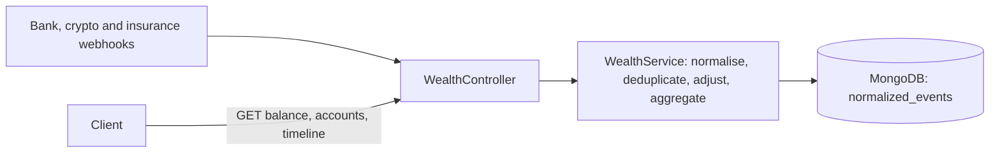

# wealth-api

A backend prototype that merges bank, crypto and insurance events into one normalised journal and computes balances per account from it.

## The problem

A person with accounts at several institutions receives events from each of them in a different shape: different field names, different ids, timestamps as ISO strings or Unix seconds or milliseconds, and different sign conventions. The same event can arrive twice, arrive late, or arrive again with a different amount. Adding up the raw payloads counts some movements twice. Overwriting the stored event to fix a contradiction destroys the history that explains the balance.

## The approach

Every webhook payload is mapped to one `NormalizedEvent`: a signed amount, the business date of the transaction, a stable id built from provider and provider-side id, and a group key. Events are only appended.

When an event arrives, the service looks for an existing one with the same `(userId, provider, transactionId)`:

- none found: the event is inserted;
- found, same amount and type: the delivery is ignored and reported as `duplicate`;
- found, different amount or type: the original is left untouched and a second event of origin `adjustment` is added for the difference. The response is `adjusted`.

Balances and the timeline are computed at read time from the journal. The timeline is ordered by business date, so late events land where they belong.

Trade-offs accepted for a prototype: every read loads all the events of a user (no snapshot collection), there is no currency conversion, and there is no authentication.

## Engineering highlights

- **One model for three formats.** Bank, crypto and insurance payloads each have a DTO and a normaliser that outputs the same `NormalizedEvent`. See [`wealth.service.ts`](src/wealth/wealth.service.ts) (`normalizeBankEvent`, `normalizeCryptoEvent`, `normalizeInsuranceEvent`) and [`normalized-event.dto.ts`](src/wealth/dto/normalized-event.dto.ts).
- **Duplicate detection.** A replayed event with the same effect is recognised and answered with `duplicate`. See `findExistingEvent` and `storeNormalizedEvent` in [`wealth.service.ts`](src/wealth/wealth.service.ts).
- **Append-only corrections.** A contradictory event produces an `adjustment` event instead of an update, and keeps the previous and new payloads in `rawData`. See `createAdjustmentEvent` in [`wealth.service.ts`](src/wealth/wealth.service.ts). The replay behaviour is a known issue, see below.
- **Business date, not ingestion date.** `timestamp` holds the transaction date and the timeline sorts on it. [`date.helper.ts`](src/wealth/helpers/date.helper.ts) parses ISO strings, several day-first and month-first formats, and Unix timestamps in seconds or milliseconds.
- **Validated input.** DTOs use `class-validator` and a global `ValidationPipe` strips unknown fields. See [`main.ts`](src/main.ts) and [`src/wealth/dto`](src/wealth/dto).
- **Bounded reads.** The timeline accepts a `limit` between 1 and 1000. See `getTimeline` in [`wealth.service.ts`](src/wealth/wealth.service.ts).

## Architecture



All events, external and adjustments, live in one collection, `normalized_events`.

## API

| Method | Path | Purpose |
| --- | --- | --- |
| POST | `/api/webhooks/bank` | Bank transaction (`credit` or `debit`) |
| POST | `/api/webhooks/crypto` | Crypto transaction (`deposit` or `withdrawal`), valued at the `fiatValue` sent |
| POST | `/api/webhooks/insurance` | Insurance movement, always recorded as an outflow |
| GET | `/api/wealth/balance?userId=` | Total and per-account balances |
| GET | `/api/wealth/accounts?userId=` | Per-account balances |
| GET | `/api/wealth/timeline?userId=&limit=` | Events by business date, newest first. `limit` defaults to 100, maximum 1000 |

`userId` defaults to `user-001`. A webhook answers with `status` set to `success`, `duplicate` or `adjusted`, plus the `transactionId`.

Payload fields are defined by the DTO classes under [`src/wealth/dto`](src/wealth/dto). For instance:

```bash
curl -X POST http://localhost:3000/api/webhooks/bank \
  -H "Content-Type: application/json" \
  -d '{"userId":"user-001","bankId":"BANK-A","txnId":"TXN-1","date":"2025-01-01T10:00:00Z","type":"credit","amount":1000,"currency":"EUR","account":"ACC-1","description":"Initial deposit"}'
```

## Tech stack

From [`package.json`](package.json) and [`docker-compose.yml`](docker-compose.yml):

- NestJS 10 on Express, TypeScript
- MongoDB (official Node.js driver 7, image `mongo:7.0` in Compose)
- `class-validator`, `class-transformer`, `date-fns`
- Jest 29 and supertest, ESLint 8, Prettier 3

## Getting started

```bash
git clone https://github.com/guillaume-lecomte/wealth-api
cd wealth-api
npm ci
npm run build
cp .env.example .env
docker compose up -d
npm run start:dev
```

The API listens on `http://localhost:3000` (`PORT` in `.env`). `CORS_ORIGINS` must be set, the server fails at startup without it.

Verified on 2026-10-06: `npm ci` and `npm run build` succeed. Not run: `docker compose up -d` and the server itself, because the environment used for this README had neither Docker nor MongoDB. The duplicate, adjustment and invalid-date behaviours described on this page were checked by running the compiled service against an in-memory stand-in for the collection, not against MongoDB.

## Status

Prototype. Last code change 2025-12-20. Not maintained.

## Known issues

- **No automated tests.** `test/app.e2e-spec.ts` is the unmodified NestJS scaffold: it expects `Hello World!` on `/` and `npm run test:e2e` fails. There are no unit tests.
- **Idempotency relies on an index that is never created.** The code handles MongoDB duplicate-key error 11000 on insert (`storeNormalizedEvent`), but nothing in the repository creates a unique index, and `docker-compose.yml` mounts a `./mongo-init` directory that is not in the repository. Without a unique index, two simultaneous deliveries of the same event can both be inserted. This is read from the code and was not run against MongoDB.
- **A replayed contradictory event adds another adjustment each time.** The adjustment id contains `Date.now()` and nothing checks for an equivalent adjustment, so the balance drifts on every redelivery. Reproduced against the in-memory stand-in: a credit of 100 corrected to 150 gave one adjustment of 50; delivering the same correction again gave a second adjustment of 50 and a balance of 200 instead of 150.
- **An unparseable date returns a 500.** `parseDate` is called without a logger and calls `logger.warn` on its fallback paths, which throws a `TypeError`. `"not-a-date"` and `""` both fail; ISO strings, `dd/MM/yyyy` and Unix timestamps parse.
- **Insurance movements are always negative**, whatever `movementType` says. Payouts are recorded as outflows.
- **Balances mix currencies.** Amounts are added as they are and reported as `totalBalanceEUR`.
- **All of a user's events are loaded in memory** to compute a balance.
- **Startup details.** An unset `CORS_ORIGINS` crashes `main.ts`, the MongoDB connection string (credentials included) is written to the log at startup, and `MongoProvider` is registered in both `AppModule` and `WealthModule`, which creates two clients.
- **Dependencies.** `npm audit --omit=dev` on 2026-10-06 reports 13 advisories (1 critical, 5 high), mostly through NestJS 10 and Express 4.
- **Lint.** `npm run lint` reports 1 error and 71 warnings (2026-10-06). The error is that `.eslintrc.js` is not covered by the TypeScript project.

## License

No `LICENSE` file in the repository, and `package.json` declares `UNLICENSED`.
